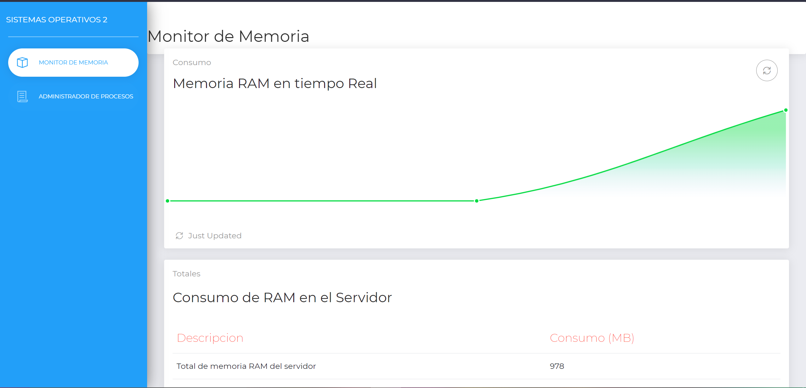
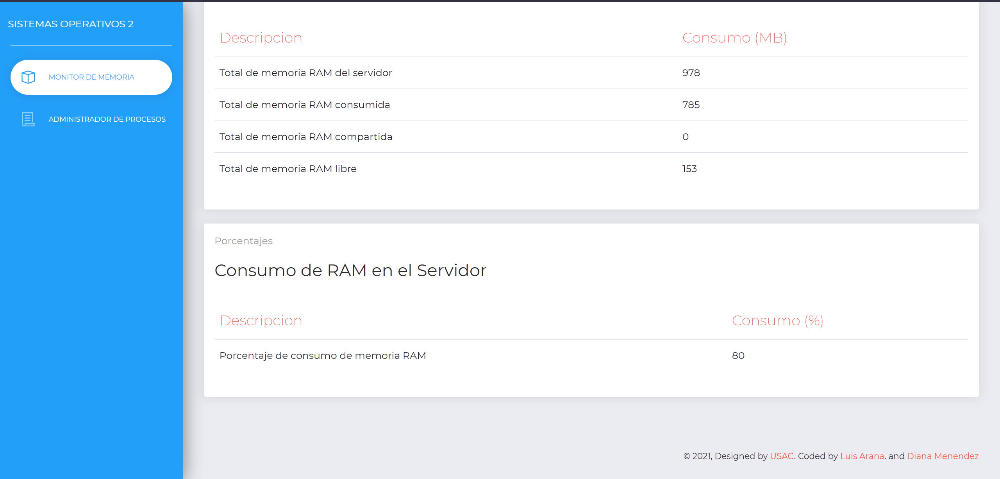
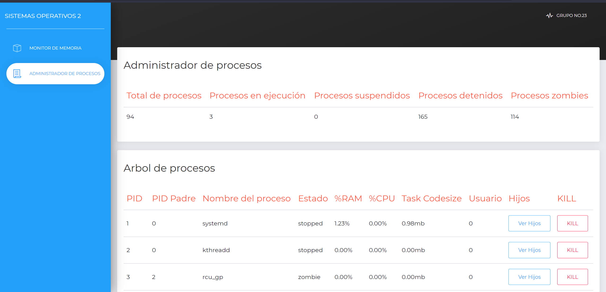

<h1> <b> Práctica #1 - Sistemas Operativos 2 </b> </h1>

<h2> <b> Manual de Tecnico</b> </h2>


## **Descripción**

Más del 50% de los servidores utilizados para construir los servicios de internet utilizan el sistema 
operativo Linux. Debido a que es un sistema seguro y de código abierto, las empresas lo utilizan por 
sus garantías y bajo costo. 
Los servicios construidos sobre Linux abarcan un amplio espectro de soluciones; sin embargo, sin 
importar los por menores de los procesos levantados en el servidor nos vemos en la necesidad de 
implementar una forma de monitorear los recursos del sistema.

---

## **Contenido**

> * [Descripción](#Descripción)
> * [Descripción de Modulos Kernel](#Descripción-de-Modulos-Kernel)
>   * [Módulo RAM](#Módulo-RAM)
>   * [Módulo Procesos](#Módulo-Procesos)
> * [Capturas de la aplicación](#Capturas-de-la-aplicación)
> * [Despliegue de la aplicación](#Despliegue-de-la-aplicación)
> * [Enlaces de herramientas utilizadas](#Enlaces-de-herramientas-utilizadas)
> * [Integrantes Grupo 4](#Integrantes-Grupo-4)

---

## **Descripción de Modulos Kernel**

En computación, un módulo cargable del núcleo es un archivo que contiene código objeto que puede extender el núcleo en ejecución de un sistema operativo. El kernel de Linux tiene un diseño modular. En el momento de arranque, sólo se carga un kernel residente mínimo en memoria.

### **Módulo RAM**

Módulo que accede a la información de la memoría RAM de la máquina donde se encuentra, utilizando el lenguaje C, se despliega en los modulos kernel.

Se utiliza la structura ````sysinfo``` para poder acceder a toda la información de la RAM de la máquina, donde se realizan los siguientes calculos y se despliega la información en el archivo como se puede ver a continuación:

```c
    si_meminfo(&i);
        totalRam = (i.totalram * i.mem_unit)/(1024*1024);
        freeRam = (i.freeram * i.mem_unit)/(1024*1024);
        sharedRam = (i.sharedram * i.mem_unit)/(1024*1024);
        bufferRam = (i.bufferram * i.mem_unit)/(1024*1024);
        usedRam = totalRam - freeRam - sharedRam - bufferRam; 
        porcentaje = (usedRam * 100)/totalRam;

        /* Información a mostrar { Total, Usado/Cache, Libre, Shared, Buffer, Porcentaje } */
        seq_printf(m, "{\"totalRam\":%d,\"usedRam\":%d,\"freeRam\":%d,\"sharedRam\":%d,\"bufferRam\":%d,\"porcentajeUsed\":%d}", totalRam, usedRam, freeRam, sharedRam, bufferRam, porcentaje);
```

Puede consultar más infomación [aquí](https://github.com/LuisArana631/SistemasOperativos2/tree/master/Practica_1/backend/ram.module).

### **Módulo Procesos**

Módulo que accede a la información de los procesos de la máquina donde se encuentra, escritó en lenguaje C, se despliega en los modulos kernel.

Se utiliza la estructura ```task_struct``` que contiene la información de todas las tareas que se encuentran en ese momento, ayudandonos de la función ```for_each_process(task)``` para poder recorrer todos los procesos, extrayendo task->comm (name), task->pid (pid), task->state (state), task->parent->pid (father), task->recent_used_cpu (usedCpu), rss = get_mm_rss(task->mm) << PAGE_SHIFT; (usedRAM), task->mm->end_code - task->mm->start_code (codeSize), (usuario) task->cred->uid.val. Estructurados de la siguiente forma:

```c
    seq_printf(m, "{\"procesos\": [\n");
    for_each_process(task) {
        get_task_struct(task);
        /* Extraer memoria utiliza en bytes */

        if (task->mm) {
            rss = get_mm_rss(task->mm) << PAGE_SHIFT;
            seq_printf(m, "{\"name\": \"%s\", \"pid\":%d, \"state\":%lu, \"father\":%d, \"usedCpu\": \"%d\", \"usedRAM\": \"%lu\", \"codeSize\": \"%lu\", \"usuario\": \"%d\"},\n",task->comm , task->pid, task->state, task->parent->pid, task->recent_used_cpu, rss, task->mm->end_code - task->mm->start_code, task->cred->uid.val);
        }else{
            seq_printf(m, "{\"name\": \"%s\", \"pid\":%d, \"state\":%lu, \"father\":%d, \"usedCpu\": \"%d\", \"usedRAM\": \"%d\", \"codeSize\": \"%d\", \"usuario\": \"%d\"},\n",task->comm , task->pid, task->state, task->parent->pid, task->recent_used_cpu, 0, 0, task->cred->uid.val);
        }

        put_task_struct(task);            
    }
    seq_printf(m, "{\"name\": \"fin\", \"pid\":\"fin\", \"state\":\"fin\", \"father\":\"fin\"}\n");
    seq_printf(m, "]}");
```

Puede consultar más infomación [aquí](https://github.com/LuisArana631/SistemasOperativos2/tree/master/Practica_1/backend/process.module).

---

## **Capturas de la aplicación**







---

## **Despliegue de la aplicación**

Para poder desplegar la aplicación utilizamos dos servicios de AWS, utilizamos una *EC2* para poder montar nuestro servidor en lenguaje go, con los modulos kernel y también utilizamos el servicio *S3* para poder desplegar nuestra página web en react y poder acceder a ella.

---

## **Enlaces de herramientas utilizadas**

- [Go](https://golang.org/)
- [C](https://www.cprogramming.com/)
- [React](https://es.reactjs.org/)
- [Structs Kernel](https://docs.huihoo.com/doxygen/linux/kernel/3.7/annotated.html)

---

## **Integrantes Grupo 23**

| Nombre Completo | Carnet |
| :----: | :----: |
| Diana Cecilia Menéndez Castillo | 201700324 |
| Luis Fernando Arana Arias | 201700988 |
