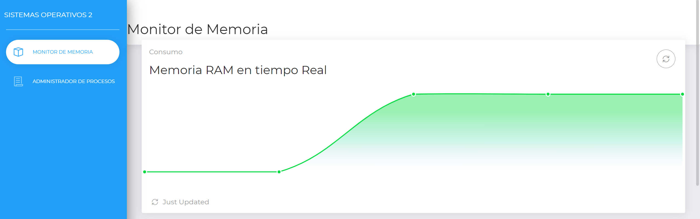
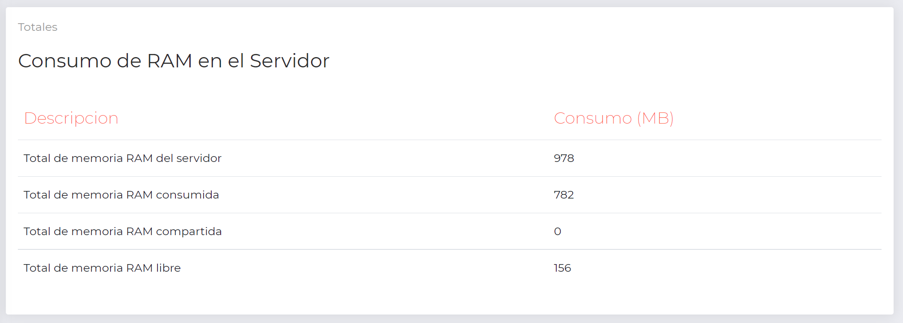
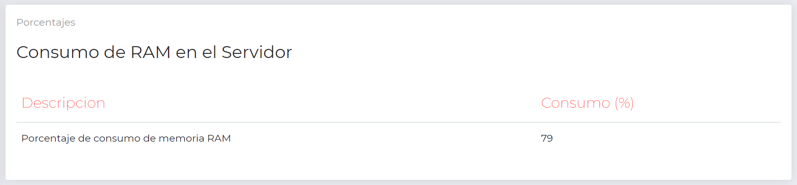
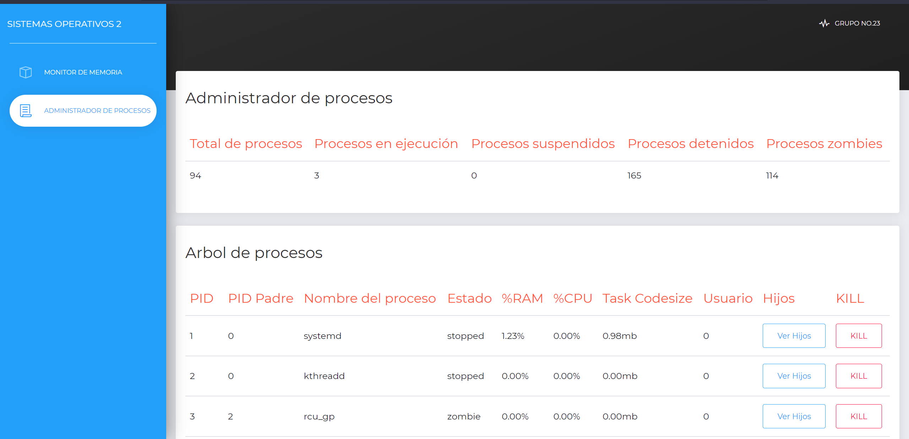
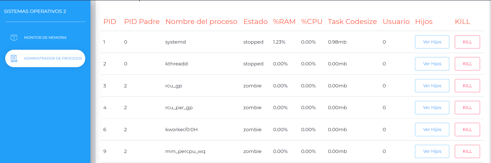
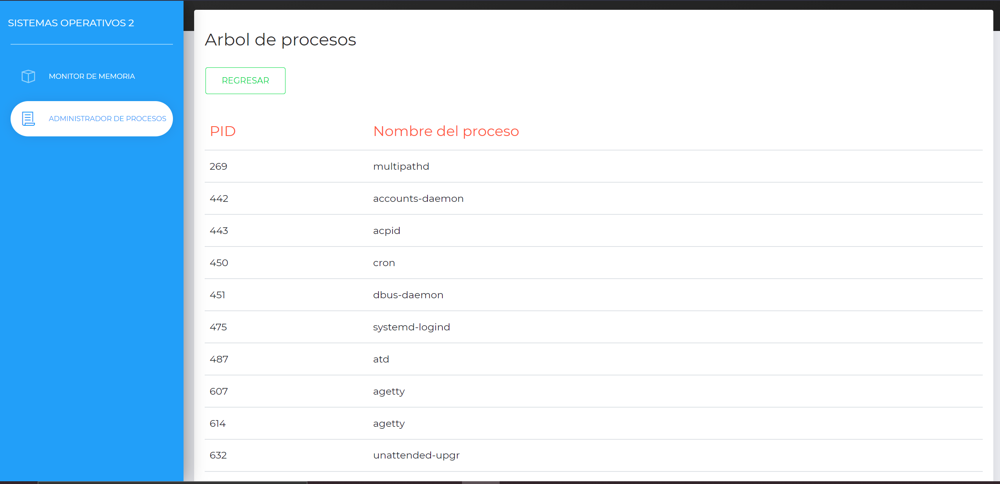

<h1> <b> Práctica #1 - Sistemas Operativos 2 </b> </h1>

<h2> <b> Manual de Usuario</b> </h2>

## **Descripción**

Más del 50% de los servidores utilizados para construir los servicios de internet utilizan el sistema 
operativo Linux. Debido a que es un sistema seguro y de código abierto, las empresas lo utilizan por 
sus garantías y bajo costo. 
Los servicios construidos sobre Linux abarcan un amplio espectro de soluciones; sin embargo, sin 
importar los por menores de los procesos levantados en el servidor nos vemos en la necesidad de 
implementar una forma de monitorear los recursos del sistema.

---

## **Contenido**

> * [Descripción](#Descripción)
> * [Descripción de Modulos Kernel](#Descripción-de-Modulos-Kernel)
>   * [Módulo RAM](#Módulo-RAM)
>   * [Módulo Procesos](#Módulo-Procesos)
> * [Capturas de la aplicación](#Capturas-de-la-aplicación)
> * [Despliegue de la aplicación](#Despliegue-de-la-aplicación)
> * [Enlaces de herramientas utilizadas](#Enlaces-de-herramientas-utilizadas)
> * [Integrantes Grupo 4](#Integrantes-Grupo-4)

---

## **Funcionalidades Implementadas**

### **Monitor de RAM**

  En este apartado de la aplicacion se puede ver facilmente a traves de una grafica en tiempo real, el consumo de memoria RAM. Esta representacion consiste en un poligono de frecuencias que muestra claramente al colocar el cursor sobre alguno de los puntos de la linea que se va trazando, la cantidad que se esta consumiendo y el numero de lectura al que corresponde, ya que todo el sistema se va actualizando cada 3 segundos.
  

### **Consumo de Memoria Total del Servidor**

  En esta parte del monitor se puede apreciar una tabla con los consumos totales de memoria en el servidor. Esta tabla contiene la informacion correspondiente a no solo memoria RAM consumida, sino el total de memoria con la que cuenta el servidor asi como la que se encuentra libre. Todos estos datos se encuentran en MB.

### **Porcentaje de Memoria Consumida del Servidor**

  En esta tabla se puede verificar el porcentaje que esta siendo consumida por recursos en el servidor.
  

### **Administrador de Procesos**
  
  En esta parte se puede observar informacion relevante del servidor, como lo son todos los procesos que se encuentran corriendo en el servidor en ese momento. La informacion general que presentan se muestra a continuacion:
  

### **Arbol de Procesos**

  El arbol de procesos consiste en una tabulacion detallada de cada proceso que se encuentra corriendo dentro del servidor. Esta informacion se muestra especifica datos como: el nombre, si posee un padre, el porcentaje de memoria RAM que utiliza, entre otros.
  

### **Hijos en el Arbol de Procesos**

  En el despliegue de informacion de cada proceso, estos cuentan con una opcion para poder visualizar sus hijos, si es que el proceso tiene procesos dependientes de el. Para ello se tiene el boton "Ver hijos" en el cual, al hacer click muestra a sus correspondientes hijos. De no poseer hijos unicamente mostrara la pantalla en blanco y permitira regresar a ver el listado de procesos.
  
 

---

## **Enlaces de herramientas utilizadas**

- [Go](https://golang.org/)
- [C](https://www.cprogramming.com/)
- [React](https://es.reactjs.org/)
- [Structs Kernel](https://docs.huihoo.com/doxygen/linux/kernel/3.7/annotated.html)

---

## **Integrantes Grupo 23**

| Nombre Completo | Carnet |
| :----: | :----: |
| Diana Cecilia Menéndez Castillo | 201700324 |
| Luis Fernando Arana Arias | 201700988 |
